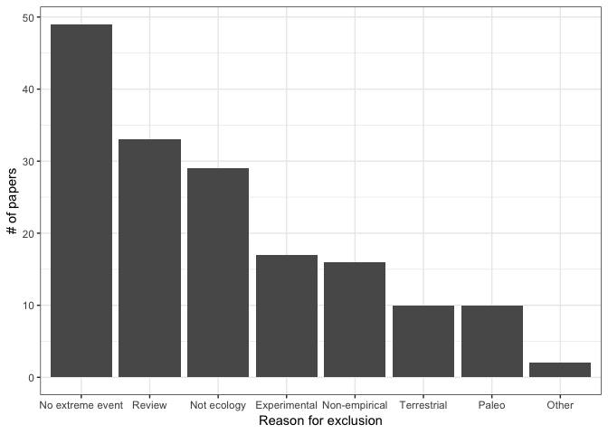

Excluded Papers
================
LRA
12/5/2019

Importing data on excluded papers

``` r
Excluded <- read.csv("Excluded papers.csv")
Excluded2 <- read.csv("Excluded papers - second round.csv")
Excluded3 <- read.csv("Excluded - final round.csv")
Excluded3$Issue <- as.character(Excluded3$Issue)
Excluded3$Volume <- as.character(Excluded3$Volume)
Excluded <- bind_rows(Excluded,Excluded2,Excluded3)
Excluded$Reason <- str_extract(Excluded$Manual.Tags,regex("(exclude).+$|(Exclude).+$"))
```

Cleaning up levels of reason to exclude

``` r
Excluded$Reason <- gsub("because","-",Excluded$Reason)
Excluded$Reason <- gsub("Exclude","exclude",Excluded$Reason)
Excluded$fReason <- as.factor(Excluded$Reason)
levels(Excluded$fReason)
## re-code broader categories of exclusion
Excluded$Reason2 <- factor(rep(NA,length(Excluded$Reason)),
                           levels=c("Review","Terrestrial","Non-empirical","No extreme event",
                                    "Paleo","Not ecology","Other","Experimental"))
Excluded$Reason2[Excluded$Reason %in% c("excluded - review",
                                        "excluded - review, book; duplicate",
                                        "excluded - book chapter/review",
                                        "excluded - review, book"
                                        )] <- "Review"
Excluded$Reason2[Excluded$Reason %in% c("excluded - terrestrial food webs",
                                        "excluded - terrestrial, fauna",
                                        "excluded - terrestrial, human disease",
                                        "excluded - terrestrial vegetation",
                                        "excluded - terrestrial, forests",
                                        "excluded - not aquatic"
                                        )] <- "Terrestrial"
Excluded$Reason2[Excluded$Reason %in% c("exclude- theoretical framework, not raw data",
                                        "excluded - modeling",
                                        "exclude - mass balance model",
                                        "excluded- no new ecological data"
                                        )] <- "Non-empirical"
Excluded$Reason2[Excluded$Reason %in% c("exclude - climate changes",
                                        "exclude - long term monitoring",
                                        "excluded - long-term trends",
                                        "exclude - not extreme event",
                                        "exclude- human stressor, but no extreme climate event",
                                        "excluded - about how ecosystem affects extreme events",
                                        "excluded - does not describe extreme event",
                                        "excluded - not about extreme events; excluded - review",
                                        "excluded - does not describe extreme event; excluded - review",
                                        "excluded - not about extreme events",
                                        "excluded - not extreme event"
                                        )] <- "No extreme event"
Excluded$Reason2[Excluded$Reason %in% c("excluded - ancient record (Phanerozoic)",
                                        "excluded - not modern",
                                        "exclude - historical",
                                        "excluded - ancient record (Holocene)",
                                        "excluded - historical data",
                                        "excluded - paleo, not modern extreme event"
                                        )] <- "Paleo"
Excluded$Reason2[Excluded$Reason %in% c("excluded - not about ecology",
                                        "excluded - not ecology",
                                        "excluded- no new ecological data"
                                        )] <- "Not ecology"
Excluded$Reason2[Excluded$Reason %in% c("excluded - symposium overview","excluded - non english")] <- "Other"
Excluded$Reason2[Excluded$Reason %in% c("excluded - experimental")] <- "Experimental"
Excluded$Reason2 <- reorder(Excluded$Reason2,Excluded$Reason2,function(x)-length(x))
```

### Plot how many papers were excluded from various categories

``` r
ggplot(Excluded,aes(x=Reason2))+geom_bar()+
  ylab("# of papers")+
  xlab("Reason for exclusion")+
  theme_bw()
```

<!-- -->

In total, our search found 215 papers, and we excluded 166, leaving 49
for analysis
